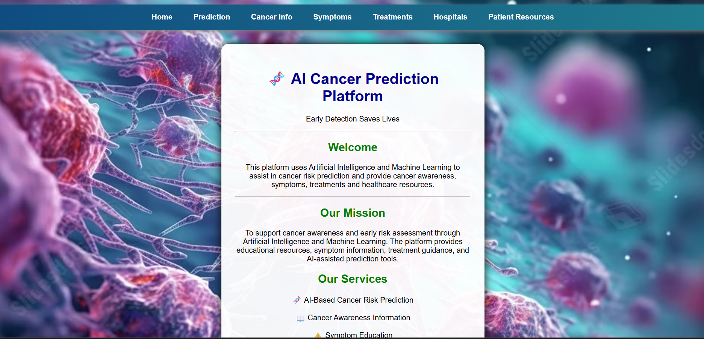
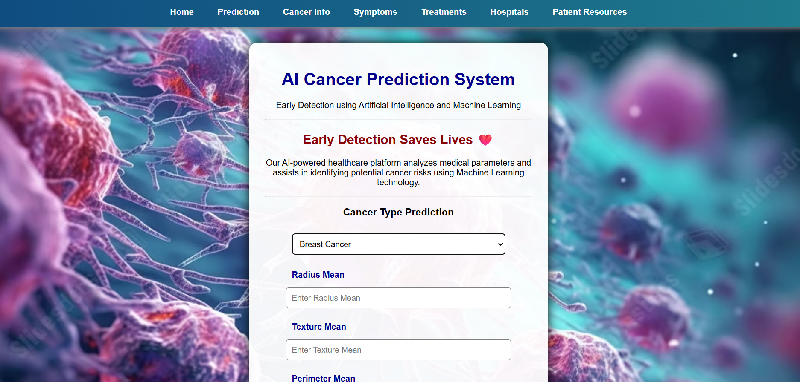
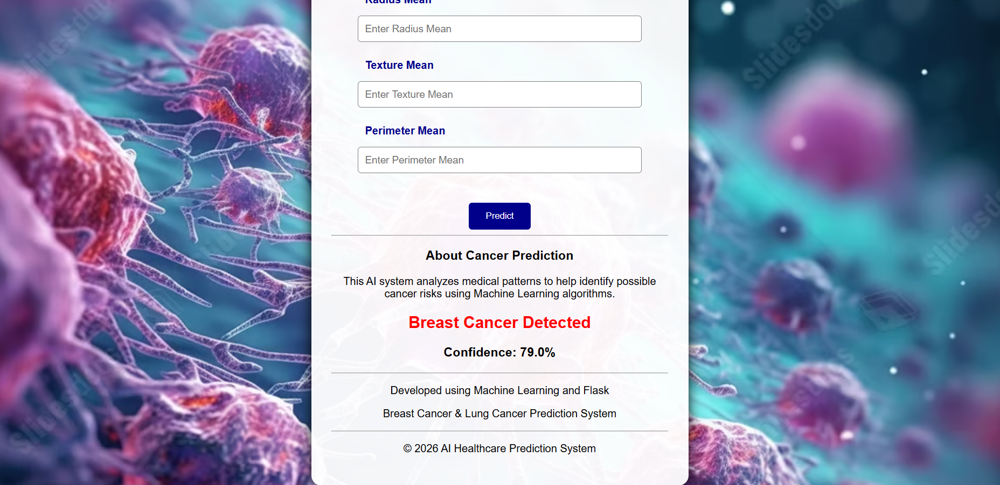
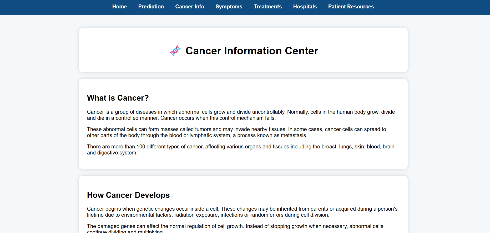
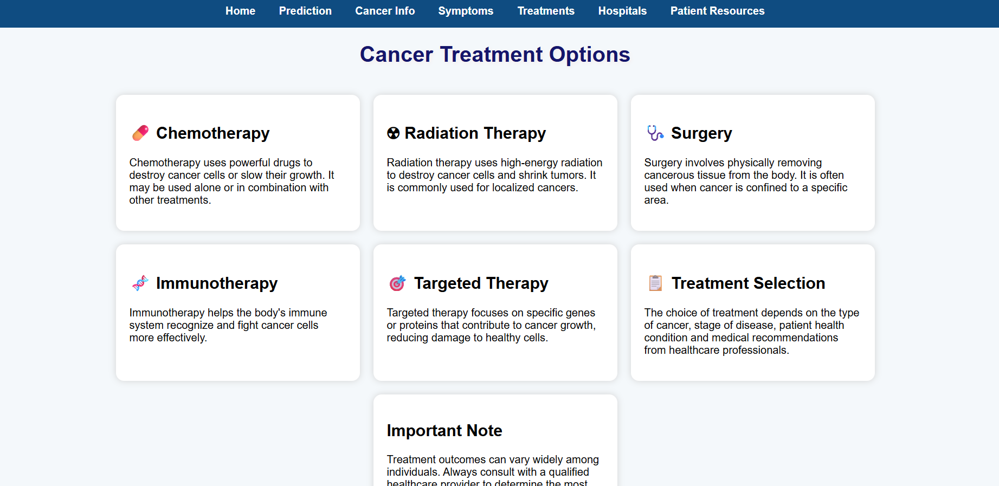

# 🧬 AI Cancer Prediction Platform


> A Flask-based Machine Learning web application for predicting Breast and Lung Cancer using Random Forest Classifier.

An AI-powered web application that predicts the likelihood of **Breast Cancer** and **Lung Cancer** using Machine Learning models built with **Random Forest Classifier** and deployed using **Flask**.

---

## 📌 Project Overview

The **AI Cancer Prediction Platform** is a Machine Learning-based healthcare application developed to demonstrate the practical use of Artificial Intelligence in disease prediction.

The platform allows users to enter selected medical parameters through a simple web interface and instantly receive an AI-generated prediction along with the confidence score of the model.

This project combines **Machine Learning**, **Flask**, and **Web Development** to provide an interactive prediction platform for educational purposes.

---

## ✨ Features

- 🩺 Breast Cancer Prediction
- 🫁 Lung Cancer Prediction
- 🤖 AI-based prediction using Random Forest Classifier
- 📊 Confidence percentage display
- 🌐 User-friendly web interface
- 📚 Cancer Information page
- ⚠ Symptoms page
- 💊 Treatments page
- 🏥 Hospitals information page
- ❤️ Patient Resources section
- ⚡ Real-time prediction using trained ML models

---

## 🛠 Technologies Used

### Programming Language
- Python

### Machine Learning
- Scikit-learn
- Random Forest Classifier

### Web Framework
- Flask

### Libraries
- Pandas
- Joblib

### Frontend
- HTML
- CSS

### Development Environment
- Visual Studio Code

---

## 📊 Model Performance

| Model | Algorithm | Accuracy |
|--------|-----------|----------|
| Breast Cancer | Random Forest Classifier | **96.49%** |
| Lung Cancer | Random Forest Classifier | **91.66%** |

---

## 🤖 Machine Learning Models

### Breast Cancer Model

**Dataset**
- Breast Cancer Wisconsin Dataset

**Algorithm**
- Random Forest Classifier

---

### Lung Cancer Model

**Dataset**
- Lung Cancer Dataset

**Algorithm**
- Random Forest Classifier

---

## 📂 Project Structure

```text
AI-Cancer-Prediction-Platform
│
├── dataset/
├── model/
├── screenshots/
├── static/
├── templates/
├── app.py
├── train_model.py
├── train_lung_model.py
├── requirements.txt
├── .gitignore
├── README.md
└── LICENSE
```

---

## ⚙ Installation

Clone the repository

```bash
git clone https://github.com/DasariAnjali1504/AI-Cancer-Prediction-Platform.git
```

Install the required libraries

```bash
pip install -r requirements.txt
```

Run the application

```bash
python app.py
```

Open your browser

```text
http://127.0.0.1:5000
```

---

## 📸 Application Preview

### 🏠 Home Page
Displays the landing page with navigation and project introduction.



---

### 🔍 Prediction Page
Allows users to select the cancer type and enter medical parameters.



---

### 📊 Prediction Result
Shows the AI prediction along with the confidence score.



---

### 📚 Cancer Information
Provides educational information about cancer, risk factors, and early detection.



---

### 💊 Treatments Page

Provides information about common cancer treatment approaches and treatment options for educational purposes.



---

## 🔮 Future Improvements

- Support additional cancer types
- Improve UI/UX
- Deep Learning integration
- Cloud deployment
- User Authentication
- Doctor Dashboard
- Database Integration
- Medical Report Generation
- Explainable AI (XAI) predictions

---

## 👩‍💻 Author

**Dasari Anjali**

Bachelor of Engineering (B.E.)

Artificial Intelligence & Machine Learning

Ballari Institute of Technology & Management

This project was developed as an academic Machine Learning project demonstrating AI applications in healthcare.
---

## 📄 License

This project is licensed under the MIT License.